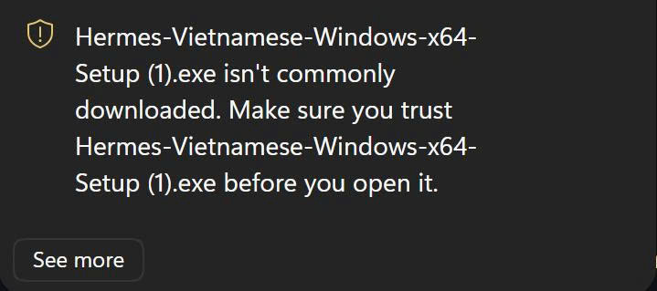
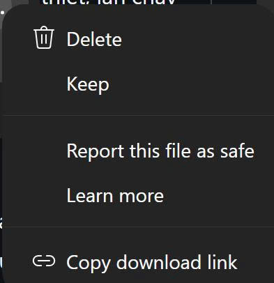
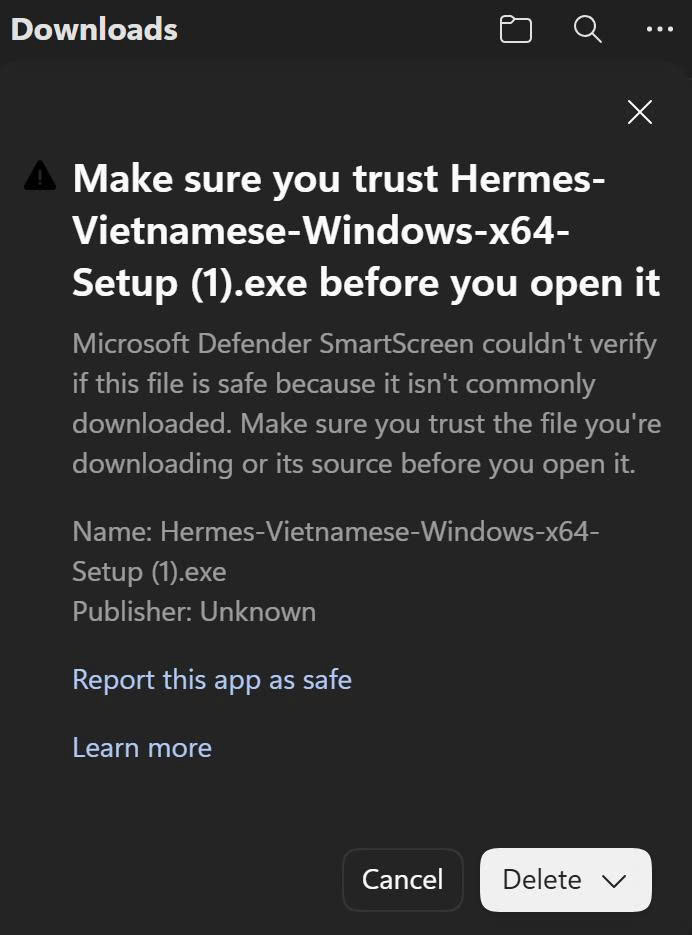
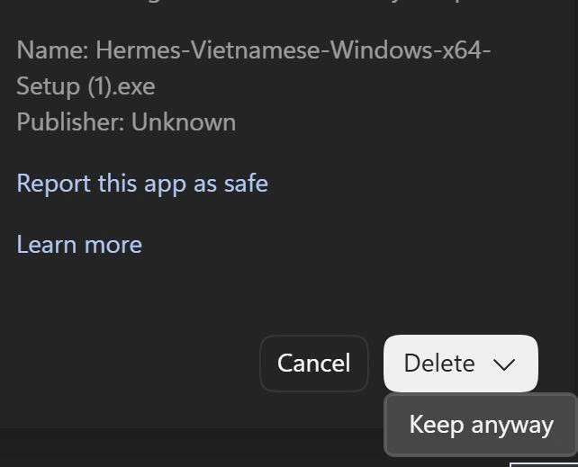

# Cài Hermes Vietnamese trên Windows bằng hình ảnh

Hướng dẫn này dành cho người tải Hermes Vietnamese bằng Microsoft Edge trên Windows 10 hoặc Windows 11. Bạn không cần mở Terminal, cài Git, cài Python hoặc sửa tệp cấu hình.

Đang dùng macOS hoặc Linux? Trang này chỉ nói về Windows. Hướng dẫn cài macOS và Linux nằm trong README tiếng Việt, ở mục [macOS](../README.vi.md#macos) và mục [Linux](../README.vi.md#linux); mục [Kiểm tra máy có phù hợp không](../README.vi.md#kiểm-tra-máy-có-phù-hợp-không) trong cùng trang giúp bạn xác nhận đúng kiến trúc máy trước khi tải.

> **Vì sao Windows cảnh báo?** Tệp hiện chưa có chữ ký xác minh nhà phát hành và chưa có nhiều lượt tải, nên Edge hoặc Windows SmartScreen có thể hiện cảnh báo uy tín. Dòng `Publisher: Unknown` trong các ảnh dưới đây phản ánh trạng thái chưa ký, không phải kết luận tệp an toàn hoặc có mã độc.

Chỉ tiếp tục khi đủ ba điều kiện:

1. Đường tải thuộc `github.com/LucDinhLe/hermes-agent-vietnamese`.
2. Tên tệp đúng với kiến trúc máy.
3. SHA-256 khớp `SHA256SUMS.txt` của chính bản phát hành đang tải.

## 1. Chọn đúng bộ cài

<!-- current-release:start -->
Latest là [2026.9.4](https://github.com/LucDinhLe/hermes-agent-vietnamese/releases/tag/v2026.9.4), community pilot chưa phải stable; Windows chưa ký số, macOS ký ad-hoc, Linux không có cơ chế ký. Ứng dụng báo khi có bản mới kèm SHA-256, không tự tải hay tự cài.

- Windows x64: [Hermes-2026.9.4-win-x64.exe](https://github.com/LucDinhLe/hermes-agent-vietnamese/releases/download/v2026.9.4/Hermes-2026.9.4-win-x64.exe), **345852734 byte**, SHA-256 `3cd30aaad47167c439bb6637af3c531ceffc4e2f74d7a808e3a9c105e3938990`.
- macOS Apple Silicon (M1 trở lên): [Hermes-2026.9.4-mac-arm64.dmg](https://github.com/LucDinhLe/hermes-agent-vietnamese/releases/download/v2026.9.4/Hermes-2026.9.4-mac-arm64.dmg), **385594943 byte**, SHA-256 `8ebc605c66c9cc8eeed6fc314b71cbdabeedea6c62c297035296729571284d8c`.
- Linux x64 AppImage: [Hermes-2026.9.4-linux-x86_64.AppImage](https://github.com/LucDinhLe/hermes-agent-vietnamese/releases/download/v2026.9.4/Hermes-2026.9.4-linux-x86_64.AppImage), **397516248 byte**, SHA-256 `26cfec58e6776f49d5e65cbdd62908119349f7406a4fc549bc417d839134249d`.
- Linux x64 gói deb (Ubuntu/Debian): [Hermes-2026.9.4-linux-amd64.deb](https://github.com/LucDinhLe/hermes-agent-vietnamese/releases/download/v2026.9.4/Hermes-2026.9.4-linux-amd64.deb), **320996796 byte**, SHA-256 `fc513d2a836ee5c6ca9762a627bb14b01d5a2cb4e09b234fd81439b61018e351`.
- [SHA256SUMS.txt](https://github.com/LucDinhLe/hermes-agent-vietnamese/releases/download/v2026.9.4/SHA256SUMS.txt) gom mã kiểm tra của mọi tệp.
<!-- current-release:end -->

Ảnh bên dưới minh họa cảnh báo Edge từ bản cũ; tên tệp trong ảnh có thể khác 2026.9.2. Dùng tên và mã kiểm tra phía trên làm chuẩn. Bản này chưa có bộ cài ARM64.

Nếu chưa biết máy dùng x64 hay ARM64, nhấn `Windows + I`, chọn **Hệ thống → Giới thiệu** và xem dòng **Loại hệ thống**.

## 2. Khi Edge báo tệp không được tải xuống phổ biến

Edge có thể hiện dòng `isn't commonly downloaded`. Đây là cảnh báo về độ phổ biến của tệp tải xuống. Tệp sẽ không tự tiếp tục nếu bạn chỉ chờ.

1. Bấm **See more**.

2. Tùy phiên bản Edge, mở menu của tệp rồi chọn **Keep**.

3. Khi Edge hiện màn hình **Make sure you trust...**, kiểm tra lại tên tệp và nguồn tải. Dòng `Publisher: Unknown` là trạng thái hiện tại vì bộ cài chưa ký số. Bấm mũi tên `▼` cạnh **Delete**.

4. Chọn **Keep anyway** để giữ tệp.

Một số bản Edge đi thẳng từ **See more** tới màn hình có nút **Keep anyway**, nên bạn có thể không thấy đủ cả bốn màn hình. Không cần chọn **Report this app as safe** hoặc **Report this file as safe** để tiếp tục tải.

Nếu Edge tự thêm `(1)`, `(2)` vào tên vì tệp đã từng được tải, nội dung tệp có thể vẫn giống nhau. Hãy dùng SHA-256 để xác nhận, đừng chỉ dựa vào tên.

## 3. Mở bộ cài

1. Khi Edge báo tải xong, bấm biểu tượng thư mục hoặc mở thư mục **Downloads/Tải xuống**.
2. Mở tệp `Hermes-<phiên bản>-win-x64.exe` đã xác minh ở phần 1.
3. Nếu Windows SmartScreen hiện cửa sổ **Windows protected your PC**, kiểm tra lại nguồn và SHA-256 rồi chọn **More info/Thông tin thêm → Run anyway/Vẫn chạy**.

Chỉ tiếp tục khi nguồn tải, tên tệp và SHA-256 đúng như phần 1. Nếu Microsoft Defender Antivirus nêu tên một mối đe dọa cụ thể, hãy dừng lại, giữ ảnh chụp và [gửi báo lỗi](https://github.com/LucDinhLe/hermes-agent-vietnamese/issues). Không tắt Defender, SmartScreen hoặc chính sách bảo mật của toàn máy để cài Hermes.

## 4. Hoàn tất thiết lập ba bước

1. Chọn **Tiếng Việt** hoặc **English**.
2. Chờ ứng dụng chuẩn bị lõi đóng gói sẵn. Python và thư viện bắt buộc có trong bộ cài; Internet vẫn cần cho đăng nhập, AI và tính năng mạng/tùy chọn.
3. Tại **Kết nối model**, chọn một trong các đường phù hợp:
   - **OpenAI OAuth (ChatGPT):** đăng nhập tài khoản ChatGPT có quyền dùng Codex.
   - **Claude Pro / Max:** đăng nhập qua Claude Code.
   - **Google Gemini:** nhập khóa API tạo tại Google AI Studio.
   - **Nhà cung cấp khác:** nhập tài khoản, API key hoặc endpoint tương ứng.
4. Chọn model, tạo phiên đầu tiên và giao một việc thử không quan trọng.

Nếu máy đã có bản Hermes cũ, bộ cài này cài song song chứ không ghi đè. Lần mở đầu tiên, nếu tìm thấy dữ liệu Hermes cũ, ứng dụng sẽ hỏi trước khi sao chép (không xóa) cấu hình và lịch sử sang; bản cũ vẫn còn nguyên để quay lại nếu cần.

Nếu chưa có tài khoản hoặc khóa API, chọn **Tôi sẽ chọn nhà cung cấp sau**. Sau đó mở **Cài đặt → Model/Nhà cung cấp** để kết nối. Bộ cài không kèm tài khoản model, API key hoặc hạn mức trả phí.

## Kiểm tra tăng cường nếu bạn quen dùng PowerShell

Bạn có thể đối chiếu mã SHA-256 bằng tệp `SHA256SUMS.txt` trong cùng bản phát hành. Mỗi bản có mã riêng, vì vậy không dùng mã của bản cũ để kiểm tra bản mới. Trên Windows, mở PowerShell trong thư mục tải xuống và chạy `Get-FileHash .\Hermes-<phiên bản>-win-x64.exe -Algorithm SHA256`, rồi so kết quả với tệp tổng kiểm tra.

## Nếu vẫn không cài được

Trước khi cài đè, [sao lưu và kiểm tra bản sao](sao-luu-khoi-phuc.md), chờ công việc kết thúc rồi đóng ứng dụng/gateway nền. Không chọn gỡ toàn bộ dữ liệu để nâng cấp.

- **Chỉ thấy Delete và Cancel:** bấm mũi tên `▼` cạnh **Delete**, rồi chọn **Keep anyway**.
- **Chỉ thấy menu Delete/Keep:** chọn **Keep**, sau đó làm tiếp màn hình xác nhận nếu Edge hỏi lại.
- **Không thấy Run anyway:** máy có thể đang áp dụng chính sách bảo mật của cơ quan hoặc Smart App Control. Không tắt chính sách bảo mật chỉ để cài; hãy gửi ảnh cảnh báo vào mục Issues để được kiểm tra đúng trường hợp.
- **Bộ cài mở nhưng Hermes không khởi động:** chụp toàn bộ thông báo lỗi và chọn **Mở nhật ký** nếu nút này xuất hiện.

Trạng thái ký số được cập nhật tại [Chính sách ký mã](../CODE_SIGNING_POLICY.md).
