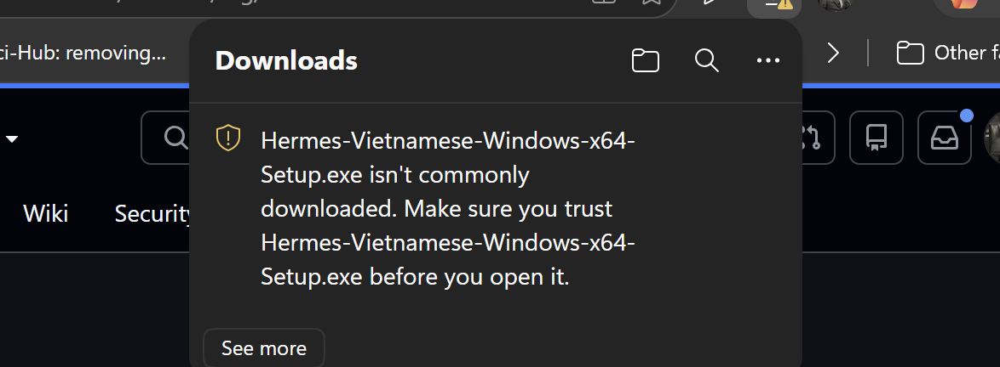
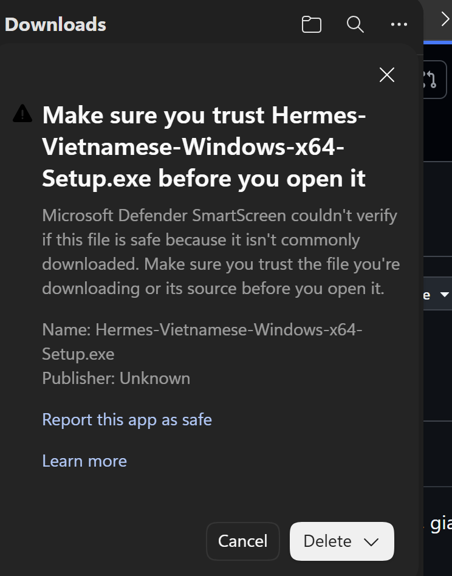

# Cài Hermes Vietnamese trên Windows bằng hình ảnh

Hướng dẫn này dành cho người tải Hermes Vietnamese bằng Microsoft Edge trên Windows 10 hoặc Windows 11. Bạn không cần mở Terminal hay sửa tệp cấu hình.

> **Vì sao Windows cảnh báo?** Bản cộng đồng hiện đang chờ xét duyệt ký số từ SignPath Foundation. Vì tệp chưa có chữ ký xác minh nhà phát hành và chưa có nhiều lượt tải, Edge hoặc Windows SmartScreen có thể hiện cảnh báo uy tín. Đây không phải kết luận rằng tệp có mã độc.

## 1. Chọn đúng bộ cài

1. Mở [bản phát hành vi-v0.20.0-12](https://github.com/LucDinhLe/hermes-agent-vietnamese/releases/tag/vi-v0.20.0-12).
2. Trong phần **Assets**, chọn:
   - Máy Windows x64 thông dụng: `Hermes-Vietnamese-Windows-x64-Setup.exe`.
   - Máy Windows ARM64: `Hermes-Vietnamese-Windows-arm64-Setup.exe`.
3. Chỉ tải tệp từ kho `LucDinhLe/hermes-agent-vietnamese` trên GitHub.

Nếu chưa biết máy dùng x64 hay ARM64, nhấn `Windows + I`, chọn **Hệ thống → Giới thiệu** và xem dòng **Loại hệ thống**.

## 2. Khi Edge báo tệp không được tải xuống phổ biến

Edge có thể hiện dòng `isn't commonly downloaded`. Tệp sẽ không tự tiếp tục nếu bạn chỉ chờ.

1. Bấm **See more**.



2. Ở màn hình tiếp theo, bấm mũi tên `▼` cạnh nút **Delete**.
3. Chọn **Keep anyway** để giữ tệp.



Không cần chọn **Report this app as safe** để tiếp tục tải.

## 3. Mở bộ cài

1. Khi Edge báo tải xong, bấm biểu tượng thư mục hoặc mở thư mục **Downloads/Tải xuống**.
2. Mở `Hermes-Vietnamese-Windows-x64-Setup.exe` hoặc bản ARM64 tương ứng.
3. Nếu Windows SmartScreen hiện cửa sổ **Windows protected your PC**, chọn **More info/Thông tin thêm → Run anyway/Vẫn chạy**.

Chỉ tiếp tục khi tên tệp và nguồn tải đúng như phần 1. Nếu Microsoft Defender Antivirus thông báo đã phát hiện một mối đe dọa cụ thể, hãy dừng lại và [gửi báo lỗi](https://github.com/LucDinhLe/hermes-agent-vietnamese/issues), không tự bỏ qua cảnh báo đó.

## 4. Hoàn tất thiết lập ba bước

1. Chọn **Tiếng Việt** hoặc **English**.
2. Chọn cài Hermes trên máy và chờ ứng dụng chuẩn bị môi trường chạy. Lần đầu cần Internet và có thể mất vài phút.
3. Chọn **ChatGPT**, **Claude Pro/Max**, **Gemini** hoặc một nhà cung cấp khác. Bạn cũng có thể chọn **Tôi sẽ chọn nhà cung cấp sau**.
4. Chọn model và bắt đầu giao việc.

## Kiểm tra tăng cường nếu bạn quen dùng PowerShell

Mã SHA-256 của bộ cài Windows x64 thuộc bản `vi-v0.20.0-12` là:

```text
CD42357D336B3F21FA2017FD521169EF00A034ABDA9524909DA700A3CDC7C989
```

Bạn có thể đối chiếu bằng `SHA256SUMS.txt` trong cùng bản phát hành. Việc kiểm tra mã băm là bước tăng cường; luồng cài đặt bằng giao diện ở trên không yêu cầu dùng dòng lệnh.

## Nếu vẫn không cài được

- **Chỉ thấy Delete và Cancel:** bấm mũi tên `▼` cạnh **Delete**, rồi chọn **Keep anyway**.
- **Không thấy Run anyway:** máy có thể đang áp dụng chính sách bảo mật của cơ quan hoặc Smart App Control. Không tắt chính sách bảo mật chỉ để cài; hãy gửi ảnh cảnh báo vào mục Issues để được kiểm tra đúng trường hợp.
- **Bộ cài mở nhưng Hermes không khởi động:** chụp toàn bộ thông báo lỗi và chọn **Mở nhật ký** nếu nút này xuất hiện.

Trạng thái ký số được cập nhật tại [Chính sách ký mã](../CODE_SIGNING_POLICY.md).
